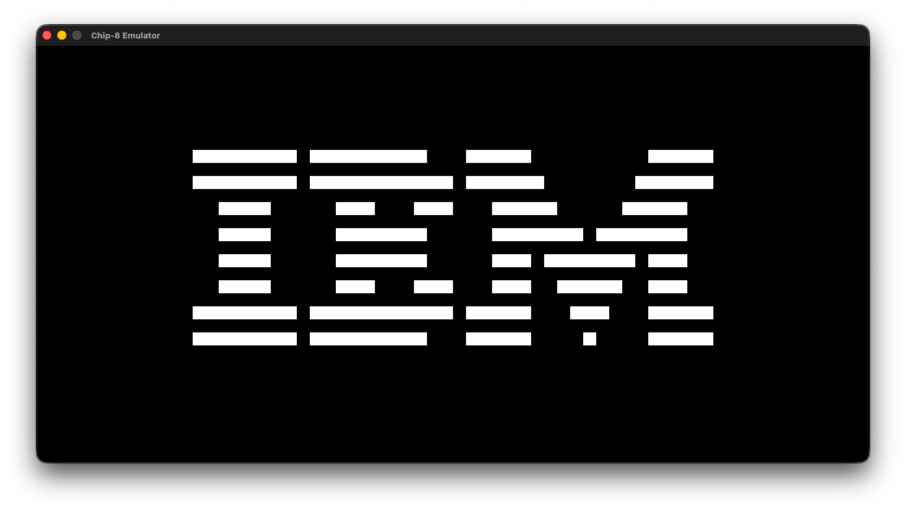
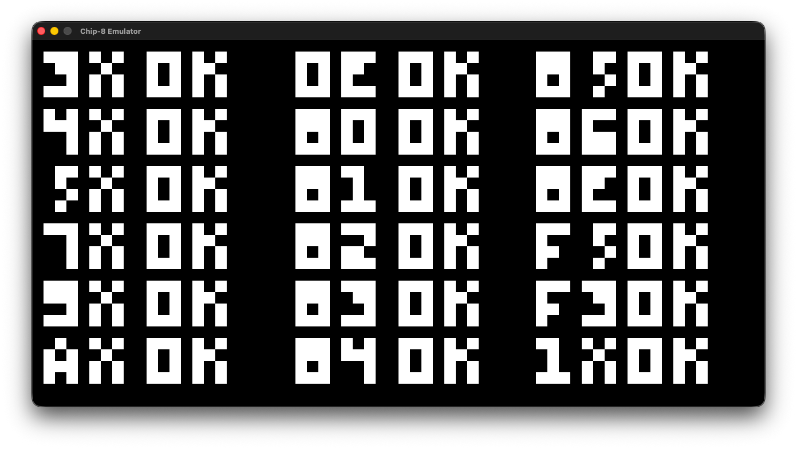
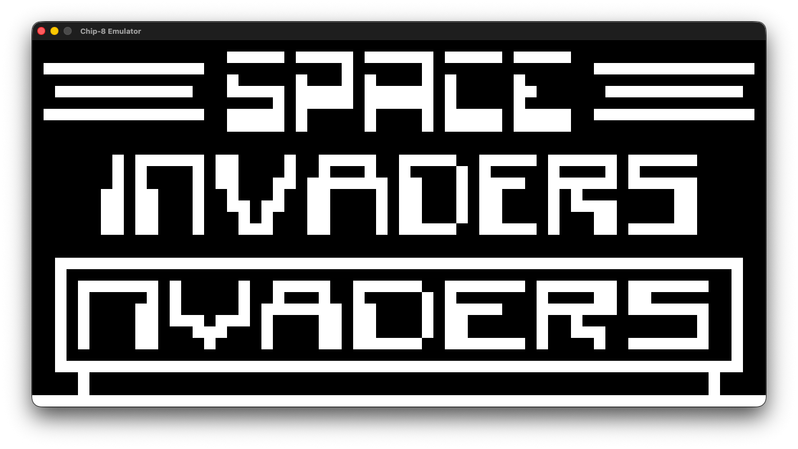

# CHIP-8 Emulator

A [CHIP-8](https://en.wikipedia.org/wiki/CHIP-8) emulator/interpreter written in C++ (C++20), using [raylib](https://www.raylib.com/) for graphics, input and sound.

<table>
  <tr>
    <td width="50%" align="center"><br><em>IBM Logo</em></td>
    <td width="50%" align="center"><br><em><a href="https://github.com/corax89/chip8-test-rom">corax89's opcode test</a></em></td>
  </tr>
</table>

### Features

- Complete CHIP-8 instruction set
- 4 KB memory, sixteen 8-bit registers `V0`-`VF`, 16-bit index register and a call stack
- 64×32 monochrome display, scaled 20× to a 1280×640 window
- Delay and sound timers ticking at 60 Hz, and a beep while the sound timer is active
- 16-key hex keypad mapped to the keyboard
- Unit tests (GoogleTest)

<p align="center">
  
  <br>
  <em>Space Invaders</em>
</p>

### Building & Running

Requires CMake 3.11+ and C++20 compiler. raylib and GoogleTest are fetched by CMake.

```sh
cmake -B build
cmake --build build
```

Run from the repository root:

```sh
./build/chip8_emulator <ROM file>
```

The `roms/` folder has a few games and test ROMs to try out.

### Controls

<table>
<tr><th colspan="4">CHIP-8 keypad</th><th></th><th colspan="4">Keyboard</th></tr>
<tr><td>1</td><td>2</td><td>3</td><td>C</td><td>→</td><td>1</td><td>2</td><td>3</td><td>4</td></tr>
<tr><td>4</td><td>5</td><td>6</td><td>D</td><td>→</td><td>Q</td><td>W</td><td>E</td><td>R</td></tr>
<tr><td>7</td><td>8</td><td>9</td><td>E</td><td>→</td><td>A</td><td>S</td><td>D</td><td>F</td></tr>
<tr><td>A</td><td>0</td><td>B</td><td>F</td><td>→</td><td>Z</td><td>X</td><td>C</td><td>V</td></tr>
</table>

Press `Esc` to quit.

### Tests

```sh
ctest --test-dir build
```

### Project structure

```
src/internals.h/.cpp   CHIP-8: memory, registers, fetch/decode/execute
src/main.cpp           raylib window, main loop, rendering, input, sound
test/chip8_test.cpp    unit tests for instructions
sound/                 8-bit beep sound
roms/                  test ROMs
```

